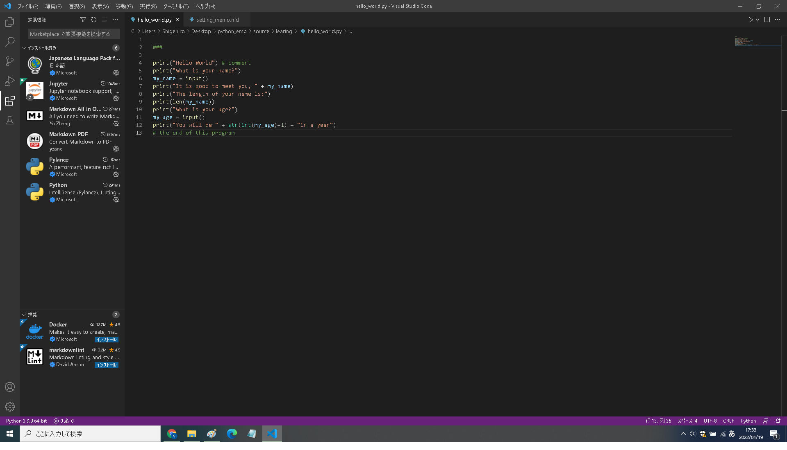

# Python embeddable環境の構築メモ
- Windows10 Ver.20H2 64bit
- 参考記事 https://qiita.com/koppe/items/7fe62d483d351566d809
  
## Pythtonインタープリタ

1. python embeddable環境をダウンロードし解凍する。
	・https://www.python.org/downloads/windows/

2. 初期設定
	・解凍したフォルダに保存されている「pythonバージョン._pth」というファイル内の「import site」に付与されたコメントアウトを外す。

3. pipのインストール
	・get-pip.pyをダウンロードして、コマンドプロンプトで実行する。

```
C:\Users\Shigehiro>cd C:\Users\Shigehiro\Desktop\python_emb\python-3.9.9-embed-amd64
￥C:\Users\Shigehiro\Desktop\python_emb\python-3.9.9-embed-amd64>python.exe get-pip.py
Collecting pip
  Using cached pip-21.3.1-py3-none-any.whl (1.7 MB)
Collecting setuptools
  Using cached setuptools-60.5.0-py3-none-any.whl (958 kB)
Collecting wheel
  Using cached wheel-0.37.1-py2.py3-none-any.whl (35 kB)
Installing collected packages: wheel, setuptools, pip
  WARNING: The script wheel.exe is installed in 'C:\Users\Shigehiro\Desktop\python_emb\python-3.9.9-embed-amd64\Scripts' which is not on PATH.
  Consider adding this directory to PATH or, if you prefer to suppress this warning, use --no-warn-script-location.
  WARNING: The scripts pip.exe, pip3.9.exe and pip3.exe are installed in 'C:\Users\Shigehiro\Desktop\python_emb\python-3.9.9-embed-amd64\Scripts' which is not on PATH.
  Consider adding this directory to PATH or, if you prefer to suppress this warning, use --no-warn-script-location.
Successfully installed pip-21.3.1 setuptools-60.5.0 wheel-0.37.1
```

## vscodeを用いたpython統合開発環境の構築


1. VS Codeのインストール・日本語化
   
	- https://code.visualstudio.com/download
	- 管理者権限不要のUser Installerを利用

2. Python拡張機能のインストール
   - embeddable版Pythonのインタプリタへのパスを指定する。




## Pyautoguiのインストール


- pyautogui
  
```

C:\Users\Shigehiro\Desktop\python_emb\interpreter\working\python-3.9.9-embed-amd64\Scripts>pip install pyautogui
Collecting pyautogui
  Downloading PyAutoGUI-0.9.53.tar.gz (59 kB)
     |████████████████████████████████| 59 kB 332 kB/s
  Preparing metadata (setup.py) ... done
Collecting pymsgbox
  Downloading PyMsgBox-1.0.9.tar.gz (18 kB)
  Installing build dependencies ... done
  Getting requirements to build wheel ... done
  Preparing metadata (pyproject.toml) ... done
Collecting PyTweening>=1.0.1
  Downloading pytweening-1.0.4.tar.gz (14 kB)
  Preparing metadata (setup.py) ... done
Collecting pyscreeze>=0.1.21
  Downloading PyScreeze-0.1.28.tar.gz (25 kB)
  Installing build dependencies ... done
  Getting requirements to build wheel ... done
  Preparing metadata (pyproject.toml) ... done
Collecting pygetwindow>=0.0.5
  Downloading PyGetWindow-0.0.9.tar.gz (9.7 kB)
  Preparing metadata (setup.py) ... done
Collecting mouseinfo
  Downloading MouseInfo-0.1.3.tar.gz (10 kB)
  Preparing metadata (setup.py) ... done
Collecting pyrect
  Downloading PyRect-0.1.4.tar.gz (15 kB)
  Preparing metadata (setup.py) ... done
Collecting pyperclip
  Downloading pyperclip-1.8.2.tar.gz (20 kB)
  Preparing metadata (setup.py) ... done
Building wheels for collected packages: pyautogui, pygetwindow, pyscreeze, PyTweening, mouseinfo, pymsgbox, pyperclip, pyrect
  Building wheel for pyautogui (setup.py) ... done
  Created wheel for pyautogui: filename=PyAutoGUI-0.9.53-py3-none-any.whl size=36614 sha256=9e79d8d752b1ad76f9fbdc0c21bd50ca676061c2ec56e1156479f1b61648ab9e
  Stored in directory: c:\users\shigehiro\appdata\local\pip\cache\wheels\d8\97\e4\d2edca92a87d3b5fbfb527264750a17b4ba297b9a7cab6e67f
  Building wheel for pygetwindow (setup.py) ... done
  Created wheel for pygetwindow: filename=PyGetWindow-0.0.9-py3-none-any.whl size=11081 sha256=ea2c49d390436d455b41506bedf9c6c01081d72f6e6f4dbd132a568334481477
  Stored in directory: c:\users\shigehiro\appdata\local\pip\cache\wheels\44\ab\20\423c3a444793767e4e41f8377bc902f77bee212e68dcce85a5
  Building wheel for pyscreeze (pyproject.toml) ... done
  Created wheel for pyscreeze: filename=PyScreeze-0.1.28-py3-none-any.whl size=13021 sha256=93db23d3745301b9b458ffc7e76681c4b41a4c499e007d812463b00b5f0ac62b
  Stored in directory: c:\users\shigehiro\appdata\local\pip\cache\wheels\a2\5b\86\99f1d8fac5d92de0ccb3f0d4ad15e3f4278baf75a9b0f20b93
  Building wheel for PyTweening (setup.py) ... done
  Created wheel for PyTweening: filename=pytweening-1.0.4-py3-none-any.whl size=5854 sha256=8298c88f705f2ad1a2e72f055e4206f5d7c06a79a6036d4992aa7283b4caf95b
  Stored in directory: c:\users\shigehiro\appdata\local\pip\cache\wheels\a4\5d\d2\ba4c8f82163233ffaadcf383c1e34d7d92635d357d13e7b78d
  Building wheel for mouseinfo (setup.py) ... done
  Created wheel for mouseinfo: filename=MouseInfo-0.1.3-py3-none-any.whl size=10906 sha256=e42765c061376b43eb1217b29df879f1ede0f58e86a44284ecdb8f807ba13b2c
  Stored in directory: c:\users\shigehiro\appdata\local\pip\cache\wheels\61\73\b9\6fb1131ab36e650206e3aa0ad7a68907b41b32ac2d4f75f543
  Building wheel for pymsgbox (pyproject.toml) ... done
  Created wheel for pymsgbox: filename=PyMsgBox-1.0.9-py3-none-any.whl size=7420 sha256=05de5bee691bec929220f135bdabc9c8c1efaf176e10ea2e8d4223b93a01da0f
  Stored in directory: c:\users\shigehiro\appdata\local\pip\cache\wheels\7f\13\8c\584c519464297d9637f9cd29fd1dcdf55e2a2cab225c76a2db
  Building wheel for pyperclip (setup.py) ... done
  Created wheel for pyperclip: filename=pyperclip-1.8.2-py3-none-any.whl size=11137 sha256=89b38fb0cd4816483b482679827c17b12bbbeb9294bd45d52e747d4c4d5f37e0
  Stored in directory: c:\users\shigehiro\appdata\local\pip\cache\wheels\0c\09\9e\49e21a6840ef7955b06d47394afef0058f0378c0914e48b8b8
  Building wheel for pyrect (setup.py) ... done
  Created wheel for pyrect: filename=PyRect-0.1.4-py2.py3-none-any.whl size=9547 sha256=fd0c62d87f9871482b61df842266b033f91838f470d3681b0efe8888bb5bb8fc
  Stored in directory: c:\users\shigehiro\appdata\local\pip\cache\wheels\0e\d4\c5\b7f7be24ac0a168fd03d08afcc7c8928ef05cc1e319d1c136b
Successfully built pyautogui pygetwindow pyscreeze PyTweening mouseinfo pymsgbox pyperclip pyrect
Installing collected packages: pyrect, pyperclip, PyTweening, pyscreeze, pymsgbox, pygetwindow, mouseinfo, pyautogui
Successfully installed PyTweening-1.0.4 mouseinfo-0.1.3 pyautogui-0.9.53 pygetwindow-0.0.9 pymsgbox-1.0.9 pyperclip-1.8.2 pyrect-0.1.4 pyscreeze-0.1.28

C:\Users\Shigehiro\Desktop\python_emb\interpreter\working\python-3.9.9-embed-amd64\Scripts>

```

- opencv_python ※pyautoguiの画像認識で閾値調整を行うために必要。
  
```
PS C:\Users\Shigehiro\Desktop\python_emb\interpreter\working\python-3.10.1-embed-amd64> ./python.exe -m pip install opencv_python
Collecting opencv_python
  Downloading opencv_python-4.5.5.64-cp36-abi3-win_amd64.whl (35.4 MB)
     |████████████████████████████████| 35.4 MB 55 kB/s
Collecting numpy>=1.17.3
  Downloading numpy-1.22.3-cp310-cp310-win_amd64.whl (14.7 MB)
     |████████████████████████████████| 14.7 MB 595 kB/s
Installing collected packages: numpy, opencv-python
  WARNING: The script f2py.exe is installed in 'C:\Users\Shigehiro\Desktop\python_emb\interpreter\working\python-3.10.1-embed-amd64\Scripts' which is not on PATH.
  Consider adding this directory to PATH or, if you prefer to suppress this warning, use --no-warn-script-location.
Successfully installed numpy-1.22.3 opencv-python-4.5.5.64
WARNING: You are using pip version 21.3.1; however, version 22.0.4 is available.
You should consider upgrading via the 'C:\Users\Shigehiro\Desktop\python_emb\interpreter\working\python-3.10.1-embed-amd64\python.exe -m pip install --upgrade pip' command.
```

- Pillow ※pyautoguiでスクリーンショットを取得するために必要

```
PS C:\Users\Shigehiro\Desktop\python_emb\interpreter\working\python-3.10.1-embed-amd64> ./python.exe -m pip install pillow
Collecting pillow
  Downloading Pillow-9.0.1-cp310-cp310-win_amd64.whl (3.2 MB)
     |████████████████████████████████| 3.2 MB 3.3 MB/s
Installing collected packages: pillow
Successfully installed pillow-9.0.1
WARNING: You are using pip version 21.3.1; however, version 22.0.4 is available.
You should consider upgrading via the 'C:\Users\Shigehiro\Desktop\python_emb\interpreter\working\python-3.10.1-embed-amd64\python.exe -m pip install --upgrade pip' command.
PS C:\Users\Shigehiro\Desktop\python_emb\interpreter\working\python-3.10.1-embed-amd64>

```

- PyautoGUIのスクリーンショットと画像認識の機能をデュアルディスプレイに対応する方法
  - https://qiita.com/kznSk2/items/a6833c095aec3b8ce72e
  - ImageGrab.grab()関数のキーワード引数all_screensにTrueを指定する。
    - C:\Python\env\interpreter\working\python-3.10.1-embed-amd64\Lib\site-packages\pyscreeze\__init__.py

```
def _screenshot_win32(imageFilename=None, region=None):
    """
    TODO
    """
    # TODO - Use the winapi to get a screenshot, and compare performance with ImageGrab.grab()
    # https://stackoverflow.com/a/3586280/1893164
    # im = ImageGrab.grab()
    im = ImageGrab.grab(all_screens=True)
```


```
x,y = pyautogui.locateCenterOnScreen(os.path.join(os.path.dirname(__file__),"youtube.png"),confidence=0.8,region=(1921,0,2900,1900))
pyautogui.click(x,y)

screenshot = pyautogui.screenshot(region=(1921,0,2900,1900))
screenshot.save(os.path.join(os.path.dirname(__file__),"test.png"))
```

- pySimplegui※tkinter必須

```

PS C:\Users\Shigehiro\Desktop\python_emb\interpreter\working\python-3.10.1-embed-amd64> ./python.exe -m pip install PySimpleGUI
Collecting PySimpleGUI
  Downloading PySimpleGUI-4.57.0-py3-none-any.whl (491 kB)
     |████████████████████████████████| 491 kB 1.1 MB/s
Installing collected packages: PySimpleGUI
Successfully installed PySimpleGUI-4.57.0

PS C:\Users\Shigehiro\Desktop\python_emb\interpreter\working\python-3.10.1-embed-amd64> ./python.exe -m pip install tk
Collecting tk
  Downloading tk-0.1.0-py3-none-any.whl (3.9 kB)
Installing collected packages: tk
Successfully installed tk-0.1.0
WARNING: You are using pip version 21.3.1; however, version 22.0.4 is available.
You should consider upgrading via the 'C:\Users\Shigehiro\Desktop\python_emb\interpreter\working\python-3.10.1-embed-amd64\python.exe -m pip install --upgrade pip' command.
PS C:\Users\Shigehiro\Desktop\python_emb\interpreter\working\python-3.10.1-embed-amd64> 

```

- tkinterをembeddablePython環境にインストールする方法

  - https://tanakatarou.tech/345/
  
  - pipによるインストール不可。通常版Pythonをインストール後に、tkinter関連のファイルをembeddablePython環境にコピーする。
    - tcl
    - Lib/tkinter
    - DLLs/tcl86t.dll
    - DLLs/tk86t.dll
    - DLLs/_tkinter.pyd

```
Mode                 LastWriteTime         Length Name
----                 -------------         ------ ----
d-----        2022/01/17     17:02                Lib
d-----        2022/03/14     17:04                Scripts
d-----        2022/03/14     18:55                tcl
d-----        2022/03/14     18:56                tkinter
-a----        2022/01/17     16:53        2159352 get-pip.py
------        2021/12/06     19:28        3429624 libcrypto-1_1.dll
------        2021/12/06     19:28          32792 libffi-7.dll
------        2021/12/06     19:28         695032 libssl-1_1.dll
------        2021/12/06     19:28          32762 LICENSE.txt
------        2021/12/06     19:28         191728 pyexpat.pyd
------        2021/12/06     19:28         564063 python.cat
------        2021/12/06     19:28          98544 python.exe
------        2021/12/06     19:28          61680 python3.dll
------        2021/12/06     19:28        4471024 python310.dll
------        2021/12/06     19:29        2636909 python310.zip
-a----        2022/01/17     16:58             79 python310._pth
------        2021/12/06     19:28          97008 pythonw.exe
------        2021/12/06     19:28          25320 select.pyd
-a----        2022/01/17     18:55           1507 setting_memo.txt
------        2021/12/06     19:28        1465064 sqlite3.dll
-a----        2021/12/06     19:29        1866480 tcl86t.dll
-a----        2021/12/06     19:29        1541872 tk86t.dll
------        2021/12/06     19:28        1117936 unicodedata.pyd
------        2021/12/06     19:28          97168 vcruntime140.dll
------        2021/12/06     19:28          37240 vcruntime140_1.dll
------        2021/12/06     19:28          26352 winsound.pyd
------        2021/12/06     19:28          60656 _asyncio.pyd
------        2021/12/06     19:28          80112 _bz2.pyd
------        2021/12/06     19:28         119024 _ctypes.pyd
------        2021/12/06     19:28         247024 _decimal.pyd
------        2021/12/06     19:28         122088 _elementtree.pyd
------        2021/12/06     19:28          59120 _hashlib.pyd
------        2021/12/06     19:28         153328 _lzma.pyd
------        2021/12/06     19:28          40168 _msi.pyd
------        2021/12/06     19:28          29928 _multiprocessing.pyd
------        2021/12/06     19:28          45296 _overlapped.pyd
------        2021/12/06     19:28          26856 _queue.pyd
------        2021/12/06     19:28          74480 _socket.pyd
------        2021/12/06     19:28          93928 _sqlite3.pyd
------        2021/12/06     19:28         155888 _ssl.pyd
-a----        2021/12/06     19:28          61160 _tkinter.pyd
------        2021/12/06     19:28          20720 _uuid.pyd
------        2021/12/06     19:28          40176 _zoneinfo.pyd
```


- python embeddableインタプリターのパスを変更した場合は、pip-get.pyを再実行すること。
- pyautoguiの参考記事 : https://qiita.com/hirohiro77/items/78e26a59c2e45a0fe4e3


  
